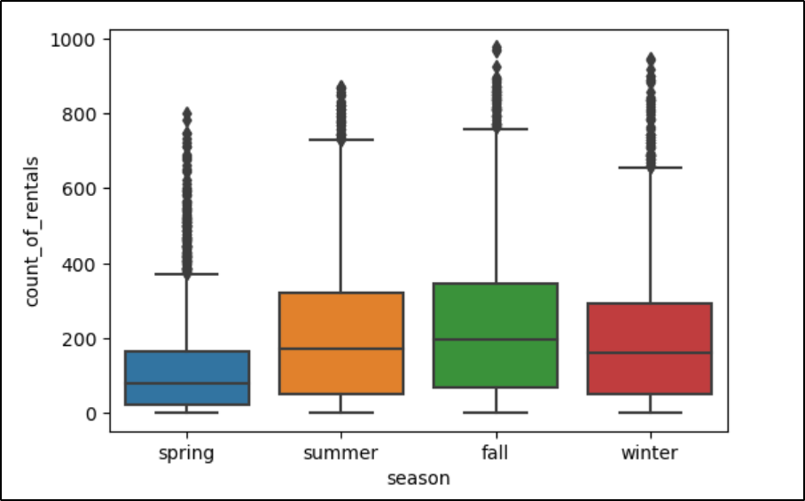
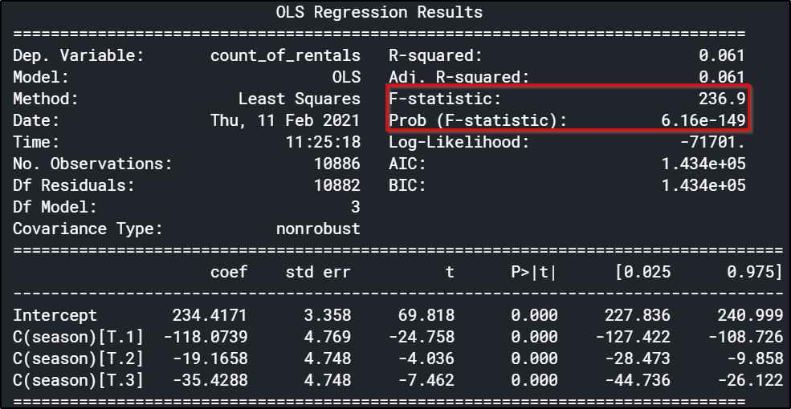

# Assignment 1
The [Kaggle Notebook Link](https://www.kaggle.com/satyads/data-analysis-tools-coursera-anova-tukey-posthoc)

## ANOVA(Analysis of Variance)
ANOVA is a statistical method to determine the difference in means of two or more categorical groups, used in a setting when the explanatory variable at hand is **Categorical** and the response variable is **Continious**.
ANOVA formulates the ratio - the between group variation to variation within the groups. We will explain this using examples. It is very helpful to decide if a categorical variable has any explanatory effects on a Continious variable. Now we will have an illustrative example.

### Data - Bike Sharing Demand
[The data can be found here.](https://www.kaggle.com/c/bike-sharing-demand/data) 
This is the hourly bike rental data for Washington.
The variable of intrest(the response variable) to be forecasted is the total number of rentals each hour.
We conside one categorical explanatory variable from the data set - **season** of the booking. 
**We try to infer if the season has an impact on the number of bike rentals.**

### Box Plot
 
We can infer from the visualizations that on an avergae the number of rentals does vary across the seasons. 
But is the variation statistically significant and that's where ANOVA comes in.

### ANOVA Results
 
The p-value for the **F-statistics** is almost zero.
It means we can reject the Null Hypothesis, we infer that difference of means of the rental counts across all seasons are significantly different.

## Tukey's HSD(Honest Significance Test)
Post Hoc tests are a must Post-ANOVA, as ANOVA doesn't clearly specify which are the pairs of groups for which is mean is significantly different. That we get from Tukey's HSD test.
 
In this case, the count rentals across all seasons are significantly different.
