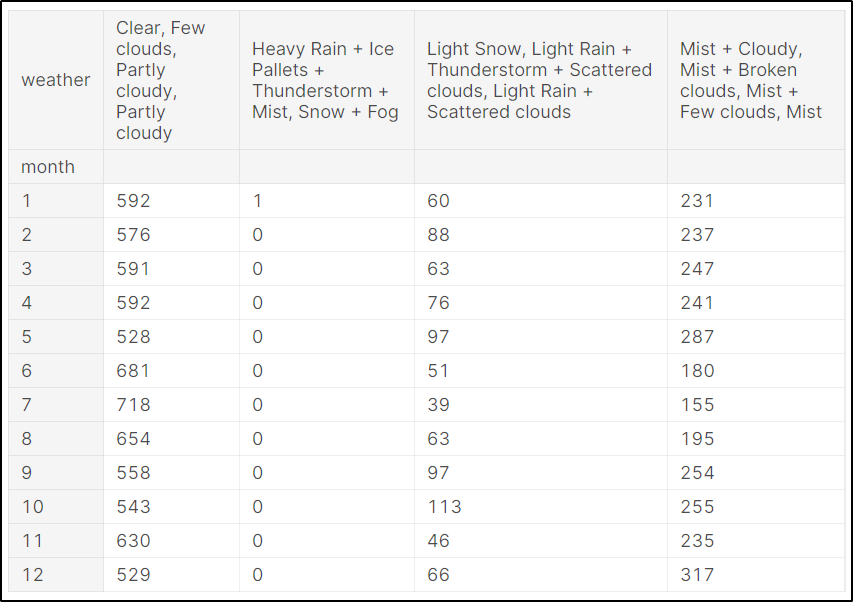
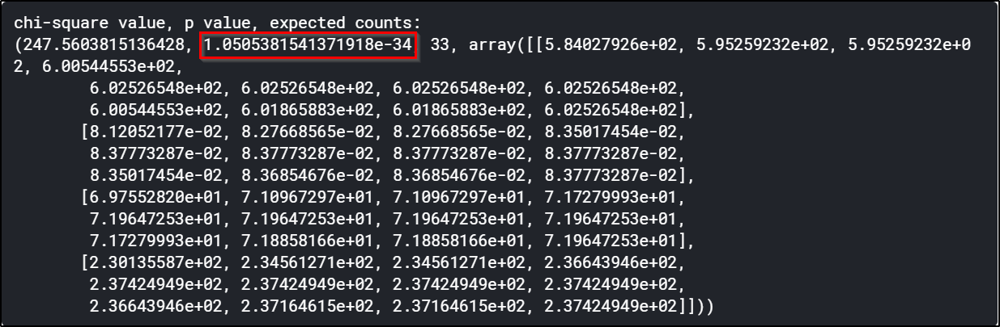
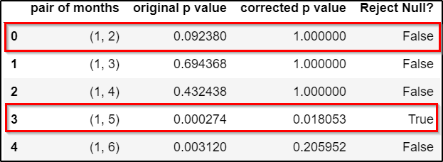

# Assignment 2

The [Kaggle Notebook Link](https://www.kaggle.com/satyads/data-analysis-tools-coursera-anova-tukey-posthoc)

## Chi Square Test of Independence

A Chi Square Test of Independence determines wheter there is any association between any two categorical variables.

The **Null Hypothesis** tells that the two categorical variables are independent, while the **Alternate Hypothesis** states that the two categorical variables have some association

### Data - Bike Sharing Demand

[The data can be found here](https://www.kaggle.com/c/bike-sharing-demand/data). 

This is the hourly bike rental data for Washington. We consider two categorical variables namely the **Month** and the **Weather** from the data. 
We try to infer if the Month has an impact on the Weather.

We begin with a Contingency Table between the variables under consideration.(The Months are designated by the Rows and the weathers as columns)

 

We run the Chi Square Test of Independecy using [scipy's chi square contingency](https://docs.scipy.org/doc/scipy/reference/generated/scipy.stats.chi2_contingency.html). 

We observe the following p-value which is almost zero(marked in red).

 

### Inference
So we can reject the Null Hypothesis and infer that there is some relationship between Month of the Year and Weather. 

## Bonferroni Adjustment for Chi Square(Post-Hoc)
Since we have multiple pairs across the two Catgorical levels(Pairs of Month and Weather), hence we do have a chance of rejecting Null Hypothesis when it actually true, essentially commiting a **Type-1 Error**. What if there is one categorical pair for which the proportion difference is significant.  A way to mitigate this is to use Bonferroni **post Chi Square Adjustement**. We compute the Chi square for multiple categorical pairs and our inference is based on a : **new significance level = $\alpha$/number of comparisons**(where $\alpha$ is most of the times **0.05**). 

Inspired by [Link](https://neuhofmo.github.io/chi-square-and-post-hoc-in-python/) 

We show the Boneferonni Adjusted values(5 of 64, others can be found on notebook).

### Bonferroni Adjusted Chi Square Test Inference

For nearly half of the pairs, we have the null hypotheis rejected and for a similar number of pairs we fail to reject the null hpothesis. Let us have some examples to illustrate this.  The month pair(1,2) i.e **January and February** dont vary much in terms of weather and the Null Hypothesis is not rejected.  However for months (1,5) - **January and May** the Null Hypothesis has been rejected, we can infer that they do vary in terms of weather(possibly **Light Snow/Rain** is significantly more during the month of May as compared to January). 
