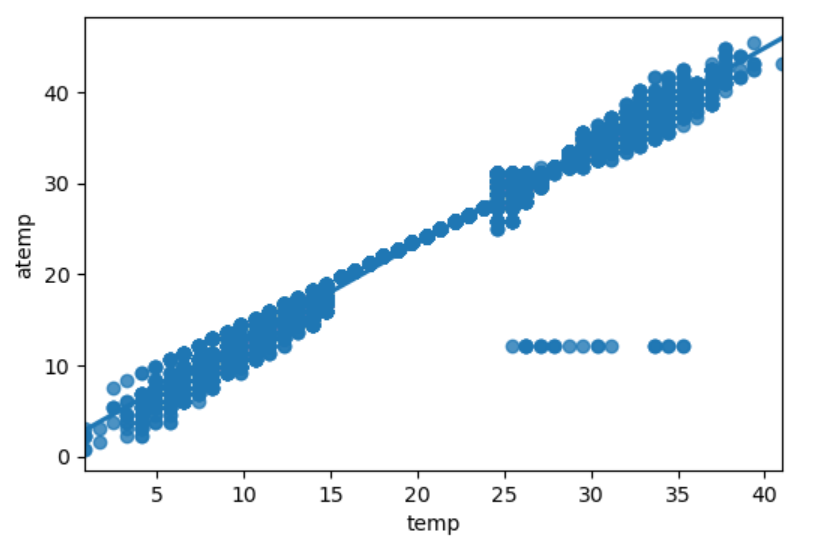

# Assignment 3

The [Kaggle Notebook Link](https://www.kaggle.com/satyads/data-analysis-tools-coursera-anova-tukey-posthoc)

## Pearson Correlation

A Pearson Correlation quantifies the association between two Continious Variables. It is in the range [-1,1]. A co-efficient which is 1(highly positive correlation) or 
-1(negatively correlated). A coefficient of zero implies no correlation.

### Data - Bike Sharing Demand

[The data can be found here](https://www.kaggle.com/c/bike-sharing-demand/data). 

This is the hourly bike rental data for Washington.
We examine association between **temp**(temperature in Celsius) and **atemp**("feels like" temperature in Celsius).
We use a regression plot(Scattered) to visualize the association.

### Regression Plot
 

### Value of Pearson Correlation
 

### Pearson Correlation Inference
A Pearson statistics of 0.98 and a p-value of zero shows a very strong statistical association between **temp** and **atemp**.
