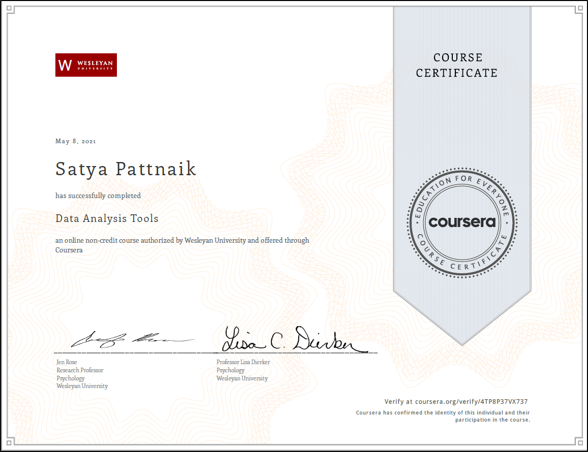

# Data Analysis Tools
This repo has all the notebooks for the course Data Anlaysis Tools by Wesleyan University.
All the Notebooks are based on Python.

## 1.ANOVA with Tukey's Honest Significance Test(Post-Hoc)
## 2.Chi Squared Test of Independence with Bonferroni Adjustment(Post-Hoc)
## 3.Pearson Correlation
## 3.Testing a Potential Moderator(ANOVA case)

